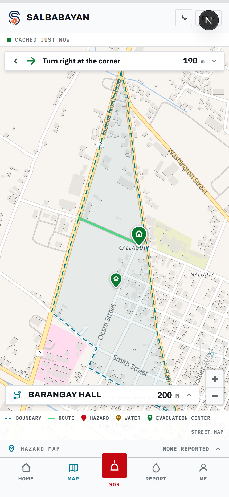

# SalbaBayan

**Barangay-level typhoon early warning and evacuation coordination — that keeps working when the network doesn't.**

*Salba* (save) + *Bayan* (town, nation).

> **Status: live.** The MVP is deployed and running for Barangay #5 Callaguip, Batac City, Ilocos Norte.
> **[Open the app →](https://salba-bayan.vercel.app)** &nbsp;·&nbsp; **[Deliverables →](stage-5/)**



*The resident's map: the barangay outline, the walking route to the nearest evacuation centre, the next turn, and the cache state in the strip at the top. Open it on a phone, turn airplane mode on, reload — it still draws.*

---

## Deliverables

| | |
|---|---|
| **Final MVP** | https://salba-bayan.vercel.app |
| **Pitch deck** | [`stage-5/SalbaBayan-Pitch-Deck.pdf`](stage-5/SalbaBayan-Pitch-Deck.pdf) — 11 slides |
| **User manual** | [`stage-5/SalbaBayan-User-Manual.pdf`](stage-5/SalbaBayan-User-Manual.pdf) — 12 pages, for residents, volunteers and officials |
| **Requirements & design** | [`stage-2/`](stage-2/) — the PRD and the wireframes this was built from |

---

## The problem

The Philippines takes roughly **20 tropical cyclones a year**. Two things break at exactly the wrong moment:

1. **The network dies.** Infrastructure collapse severs internet and cellular service mid-storm, so cloud-based early warning systems go dark precisely when people need them.
2. **National warnings aren't local instructions.** A PAGASA signal level tells a barangay *what category of storm* is coming. It never tells a resident on a specific street *what to actually do* — which route, which evacuation centre, by when, in their own language.

On top of that, dedicated IoT water-level sensors cost too much to deploy at barangay scale, and a resident in immediate danger has no fast way to summon help and be found.

## The approach

A Progressive Web App that replaces expensive infrastructure with **structure**:

- **Officials pre-configure protocols once per season.** A Purok × Signal Level table defines the route, the centre and the plain-language action for every combination — so the national-to-local translation happens in advance, not improvised mid-storm.
- **The community is the sensor network.** Residents and volunteers already on the ground report water depth and hazards. Zero hardware cost.
- **Local-first writes are the resilience layer.** Every action is written to IndexedDB in milliseconds and flushed when a signal returns. The tap never waits on a tower.

Deliberately **no** machine learning, **no** peer-to-peer networking, **no** custom cryptography, **no** IoT hardware. Every piece is a mainstream library or a managed service, so a two-person team can build and maintain it.

### The honest boundary

SalbaBayan is **not** built to survive a total, indefinite communications blackout — that would need a peer-to-peer mesh, which is out of scope. It is built for the realistic case: **intermittent connectivity**, where the client keeps working through the gaps and reconciles when a connection returns.

And it never pretends. Wherever the screen is showing something it could not re-check, it says so: `CACHED 2 HOURS AGO`, `2 WAITING TO SEND`, `NOT SENT YET — residents have not been told`. A cache that forges freshness is worse than no cache.

---

## How it works

```
ONLINE          Supabase (Postgres · Auth · Realtime · Row Level Security)
                          │ HTTPS reads/writes + Realtime subscriptions
                  Next.js client (Vercel-hosted PWA)
                   │                        │
        Service Worker cache         Dexie / IndexedDB write queue
        (app shell, routes,          (reports, SOS, headcounts,
         the barangay snapshot,       check-ins, advisory changes)
         street map, translations)           │ auto-flush on reconnect
                                      back to Supabase

OFFLINE: reads come from the cached snapshot, writes queue locally, and the UI
stays fully usable — including the map, which falls back to the barangay's own
drawn street grid when the tile server cannot be reached. No feature depends on
another device being nearby; every device talks only to Supabase.
```

**Local-first for writes, cloud-first for truth.** The UI never blocks on the network, but there is exactly one source of truth. Because devices never sync directly with each other, no conflict resolution is needed beyond retrying the queued write.

---

## What it does

**Residents**
- The barangay's signal, the instruction for their own street, and the leave-before countdown — offline
- A walking route to the **nearest of up to three evacuation centres**, computed on the phone from the street graph
- Every hazard and flood reading on one map, old readings faded and dated rather than hidden
- **One-press SOS** — no login, no form, no waiting for GPS; timed from the press even with no signal
- Hazard and flood reporting, depth measured against the body (knee / waist / chest / above head)

**Volunteers**
- A full-screen rescue map with every open call, pulsing, oldest first
- Taking a call draws **that responder's own route** to it; several may answer the same call and none sees another's line
- QR check-in at the evacuation centre, with vulnerability tags for triage
- An **append-only headcount ledger** — concurrency-safe by construction, never erased

**Officials**
- A full-screen dashboard: tap a street to place a hazard, a flood depth or an evacuation centre
- Issue the advisory behind a press-and-hold, with a preview drawn from the same components residents see
- **The PAGASA tropical cyclone bulletin, read for this barangay** — it fills the advisory form and never issues anything
- Clear flood readings, manage centres, grant roles by device code, check pre-storm readiness

**Everywhere**
- 40 languages offered — English, Filipino (Tagalog) and Cebuano written by people, the rest machine-translated and labelled as such
- Light and dark, because this is read outdoors at night on a phone whose battery may be the last one in the house

---

## Tech stack

| Layer | Technology |
|---|---|
| Frontend | Next.js 16 (App Router) · React 19 · Tailwind CSS v4 |
| Backend | Supabase — Postgres, anonymous Auth, Realtime, Row Level Security |
| Hosting | Vercel |
| Offline | Serwist (Service Worker) · Dexie.js (IndexedDB write queue) |
| Maps | MapLibre GL JS · OpenFreeMap (OpenStreetMap data) · an offline street grid generated from OSM |
| Routing | Dijkstra over the barangay's own street graph, on the phone |
| Bulletins | PAGASA's tropical cyclone bulletin, parsed server-side in a route handler |
| QR | `qrcode` (generation) · `jsqr` (scanning) |

Roles (`resident` / `volunteer` / `official`) are enforced by Postgres Row Level Security at the database layer, not just in the UI. A device cannot promote itself; an official grants roles by device code.

---

## Running it

```bash
npm install
cp .env.example .env.local     # fill in from the Supabase dashboard
npm run dev
```

Both Supabase values are publishable rather than secret — the security boundary is Row Level Security, not key secrecy.

```bash
npm run verify
```

`verify` is the gate: lint, the write-path and queue guards, the advisory, routing, language, geometry, headcount, check-in, readiness, rescue, hazard, translation and bulletin suites, a production build, and then **41 row-level-security checks fired against the live database** with real anonymous sessions. **432 checks in total**, and it is what every change has to pass.

The database is rebuildable from this repository: `supabase/migrations/` holds the schema, the policies and every UI string, and a guard fails the build if the app asks for wording no migration seeds.

---

## Repository layout

| Path | Contents |
|---|---|
| [`src/`](src/) | The application — App Router pages, components, and `lib/` where the rules live |
| [`supabase/migrations/`](supabase/migrations/) | Schema, RLS policies, and every translated string |
| [`scripts/`](scripts/) | The verification suites, the map generator, and the OSM extract |
| [`stage-2/`](stage-2/) | The PRD and the eight wireframes this was built from |
| [`stage-5/`](stage-5/) | The pitch deck and the user manual, with their sources |
| [`docs/`](docs/) | Working notes — the task log, the runbook, and the barangay handoff |

---

## Known limitations

Stated up front — these are accepted trade-offs, not oversights.

- **Total prolonged blackout is not solved.** If the backend is unreachable for an entire event, writes stay queued and cached advisories drift between residents. No device-to-device fallback.
- **Water-level accuracy depends on people.** Readings are episodic, not continuous, and need volunteers present and consistent. Readings older than three hours are faded and dated rather than trusted.
- **QR check-in is cooperative-trust, not adversarial-proof.** Right for coordinating an evacuation centre; not designed to resist forged or replayed check-ins.
- **Offline maps need one pre-storm visit.** A phone that has never opened the app has nothing cached. The app is installable precisely so this happens in fair weather.
- **The PAGASA reader has never met a live bulletin.** No cyclone entered the area of responsibility while it was built, so it is tested against fixtures. When it cannot parse a bulletin it says so and links to PAGASA, which is the failure it was designed to have.
- **Ilocano is machine-translated.** Batac speaks Ilocano. The app labels machine translation honestly, but a native speaker should write it before the barangay depends on it.
- **The offline street grid has no waterways.** A flood app whose offline map cannot show a river — the next thing worth building.

---

## Credits

Base map © OpenStreetMap contributors, served via OpenFreeMap. Bulletin data from PAGASA (DOST). Neither endorses this project.

## Team

**RCGOAT**
- John Micooh Ugot
- Nicole Anne Arciaga

**Track:** Climate Resilience and Hydrometeorological Disaster Management
