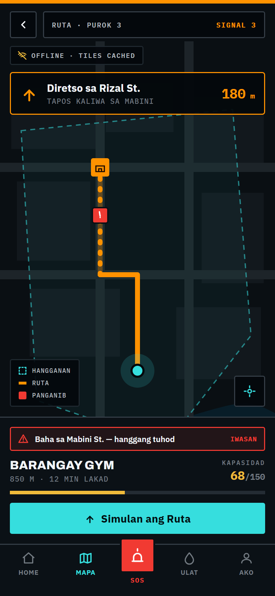
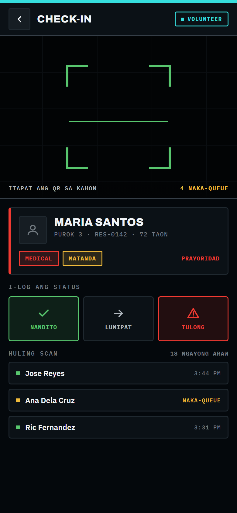
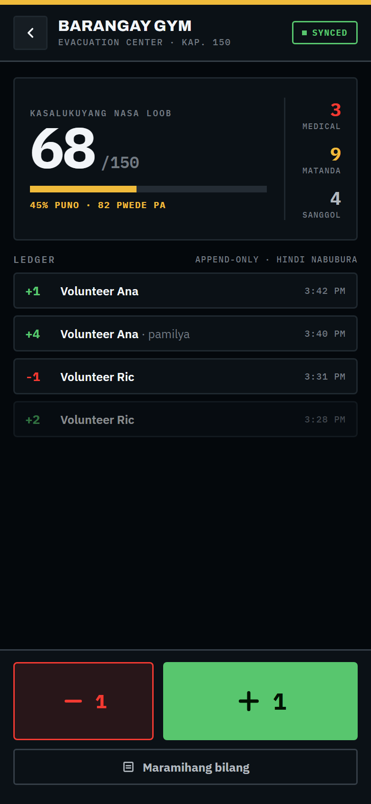
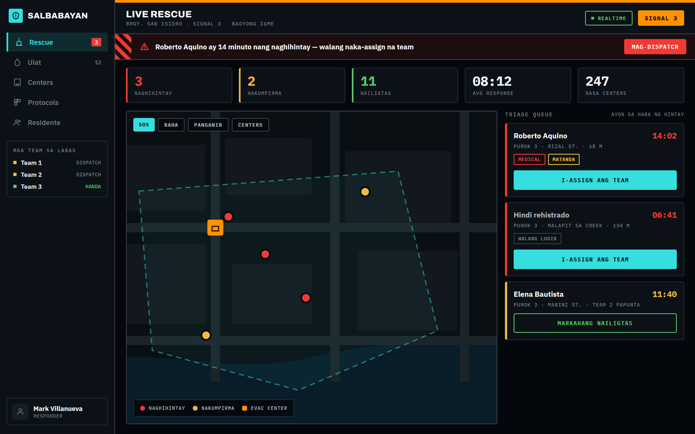
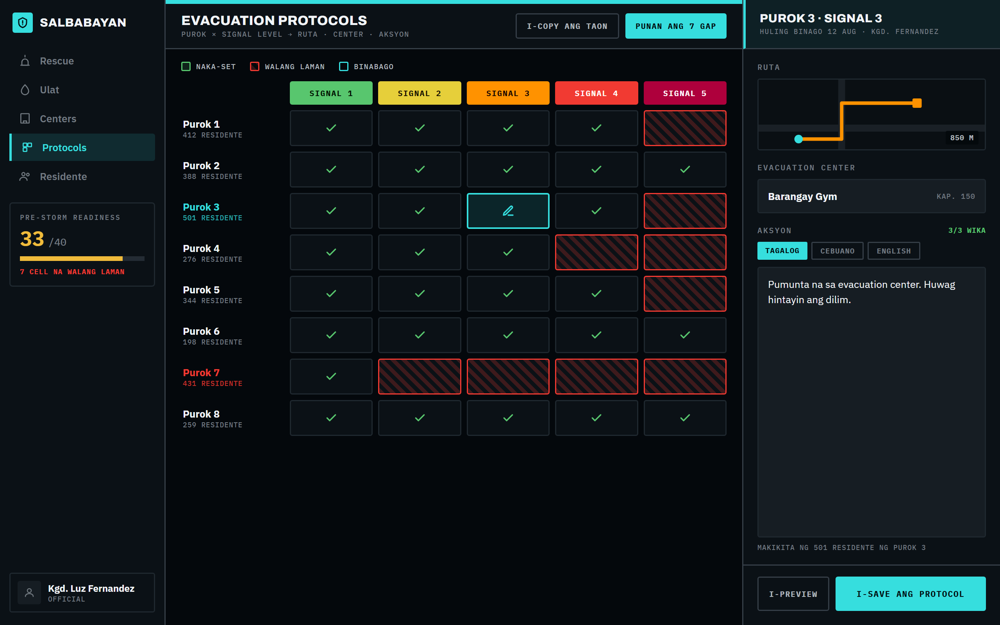

# SalbaBayan — Design

High-fidelity wireframes for the SalbaBayan PWA: eight screens covering the resident, volunteer, and responder/official paths.

```
design/
  screens/      PNG exports — what each screen actually looks like
  artboards/    .dc.html sources + canvas.json (Claude Design canvas)
```

---

## Design language

A single high-contrast, near-black interface by design, not a light/dark toggle. The real operating condition is a storm at night on a dying battery, not a lit office.

| Decision | Why |
|---|---|
| **Severity ramp is exclusive** — green through deep red, Signal 1–5 | Colour means one thing. A separate high-visibility cyan carries every interactive control, so a resident never has to ask whether orange means "tap this" or "this is dangerous" |
| **Persistent severity rail** across the top of every screen | Current signal level is ambient, never something you go looking for |
| **Instrument typography** — Archivo for headings, IBM Plex Sans for body, IBM Plex Mono for all numerals | Counts, timers, coordinates and distances read at a glance, like a readout rather than prose |
| **4px corners, 1.5px structural borders** | Reads as field equipment, not a consumer app; borders survive screen glare |
| **Hazard-stripe banding** on deadlines and alarm states | Real safety-signage vocabulary, used only where signage would use it |
| **44px minimum targets**, busiest controls in the thumb zone | Wet or gloved hands, one-handed use |

---

## Screens

### Resident

**Advisory Home** — the screen the app opens to. Signal placard, leave-by countdown, and the Purok-specific instruction resolved through the translations table. Cache age and queued-write count sit in the header, always visible.


**Evacuation Map** — MapLibre with pre-cached tile packs, Purok boundary, routing line to the assigned centre, and next-turn guidance. Hazard reports plot onto the route with an *IWASAN* (avoid) warning. Works with zero connection.



**SOS / Rescue Request** — one tap, no login. Shows queue position and the assigned responder, so a person in danger knows they have been seen. Cancelling requires a deliberate hold, so a panicked mis-tap cannot withdraw a distress call.


**Hazard & Water Report** — category tiles plus a body-referenced depth picker (*tuhod / baywang / dibdib / lampas*). Faster under stress than a dropdown, and answerable regardless of literacy.


### Volunteer

**QR Check-In** — camera scanner with triage-weighted vulnerability tags surfaced on scan. A manual token-entry fallback sits beside the scanner for when the camera fails.



**Headcount Tracker** — append-only `+1`/`−1` ledger, concurrency-safe by construction. Counter controls sized for wet hands and placed in the thumb zone.



### Responder & Official

**Live Rescue Dashboard** — active requests sorted by wait time, with the oldest unassigned escalated to a banner. Layer toggles for SOS, flooding, hazards, and evacuation centres.



**Protocol Admin** — the Purok × Signal coverage matrix. Gaps are hatched in red, because the real pre-season question is "where are my holes?", not "what does row 3 say".



---

## Artboard sources

`artboards/` holds the editable sources as Claude Design Component files (`.dc.html`) plus `canvas.json`, which lays them out on one pan/zoom canvas.

`Main.dc.html` carries two live tweaks: **signal level (1–5)** and **language (Tagalog / Cebuano / English)**. Changing either re-colours and re-words the whole home screen from the same protocol and translation data the real app would use — the clearest demonstration that the localisation layer is data, not hardcoded copy.

The PNGs in `screens/` are rendered from these sources at 2× device scale.

---

## Notes

- Sample data throughout (Barangay San Isidro, "Bagyong Igme", resident names) is placeholder, not real barangay data.
- Screens are static mockups. Only the home artboard has working controls.
- Full product requirements: [`../PRD.md`](../PRD.md).
