# SalbaBayan — Design

High-fidelity wireframes for the SalbaBayan PWA: fifteen screens covering the resident, volunteer, and responder/official paths.

```
design/
  screens/      PNG exports — what each screen actually looks like
  artboards/    .dc.html sources + canvas.json (Claude Design canvas)
```

---

## Design language

A single high-contrast, near-black interface by design, not a light/dark toggle. The real operating condition is a storm at night on a dying battery, not a lit office.

| Decision | Why |
|---|---|
| **Severity ramp is exclusive** — green through deep red, Signal 1–5 | Colour means one thing. A separate high-visibility cyan carries every interactive control, so a resident never has to ask whether orange means "tap this" or "this is dangerous" |
| **Persistent severity rail** across the top of every screen | Current signal level is ambient, never something you go looking for |
| **Instrument typography** — Archivo for headings, IBM Plex Sans for body, IBM Plex Mono for all numerals | Counts, timers, coordinates and distances read at a glance, like a readout rather than prose |
| **4px corners, 1.5px structural borders** | Reads as field equipment, not a consumer app; borders survive screen glare |
| **Hazard-stripe banding** on deadlines and alarm states | Real safety-signage vocabulary, used only where signage would use it |
| **44px minimum targets**, busiest controls in the thumb zone | Wet or gloved hands, one-handed use |

---

## Screens

### Resident

**Advisory Home** — the screen the app opens to. Signal placard, leave-by countdown, and the Purok-specific instruction resolved through the translations table. Cache age and queued-write count sit in the header, always visible.

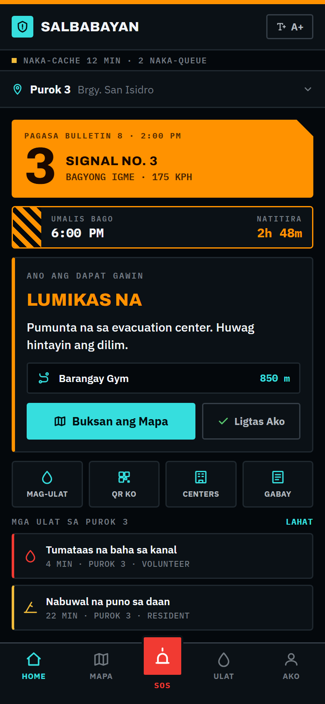

**Evacuation Map** — MapLibre with pre-cached tile packs, Purok boundary, routing line to the assigned centre, and next-turn guidance. Hazard reports plot onto the route with an *IWASAN* (avoid) warning. Works with zero connection.


**SOS / Rescue Request** — one tap, no login. Shows queue position and the assigned responder, so a person in danger knows they have been seen. Cancelling requires a deliberate hold, so a panicked mis-tap cannot withdraw a distress call.

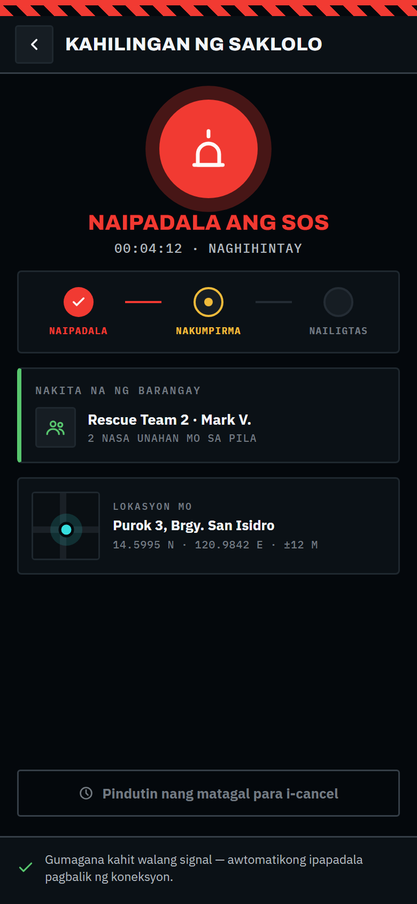

**Hazard & Water Report** — category tiles plus a body-referenced depth picker (*tuhod / baywang / dibdib / lampas*). Faster under stress than a dropdown, and answerable regardless of literacy.

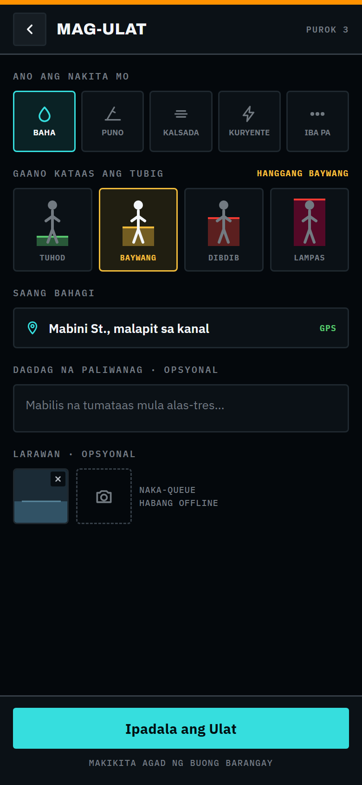

### Volunteer

**QR Check-In** — camera scanner with triage-weighted vulnerability tags surfaced on scan. A manual token-entry fallback sits beside the scanner for when the camera fails.


**Headcount Tracker** — append-only `+1`/`−1` ledger, concurrency-safe by construction. Counter controls sized for wet hands and placed in the thumb zone.


### Responder & Official

**Live Rescue Dashboard** — active requests sorted by wait time, with the oldest unassigned escalated to a banner. Layer toggles for SOS, flooding, hazards, and evacuation centres.

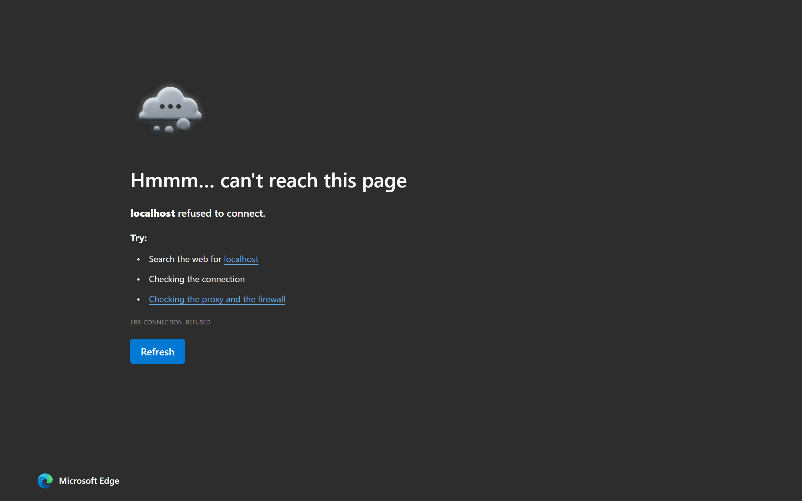

**Protocol Admin** — the Purok × Signal coverage matrix. Gaps are hatched in red, because the real pre-season question is "where are my holes?", not "what does row 3 say".


### Entry & identity

**Onboarding** — the whole of setup: language, then Purok. No account, no password, no email, because the architecture genuinely does not need one. Purok is a tap grid rather than a dropdown; it is the single value the entire advisory is keyed on, and it is chosen one-handed, possibly in the rain.

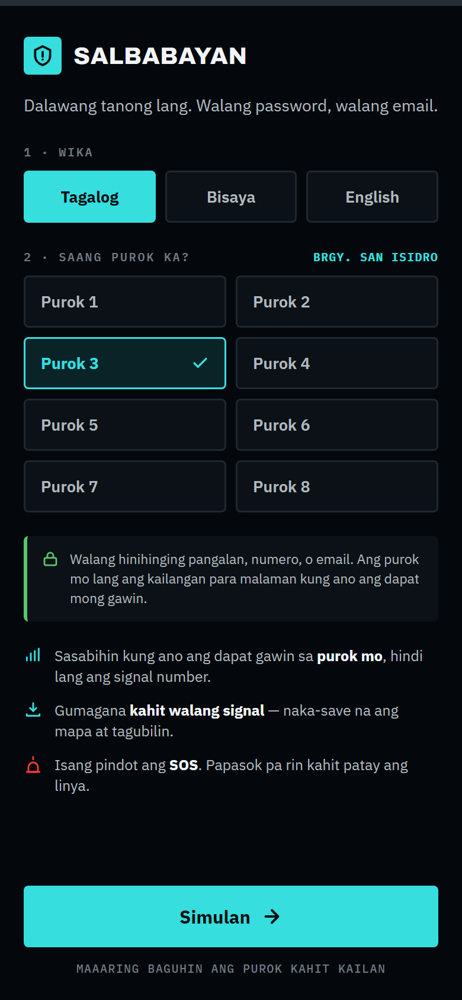

**Device & Role** — *replaces the "sign-in screen" originally listed as a gap.* The app uses anonymous authentication and never shows a login, so a login screen would contradict the architecture. The real unmet need is how a volunteer becomes one: they read out a device code, an official adds it to the roster, and the role changes at the next sync. Role limits are enforced by row-level security in Postgres, not by hiding buttons.

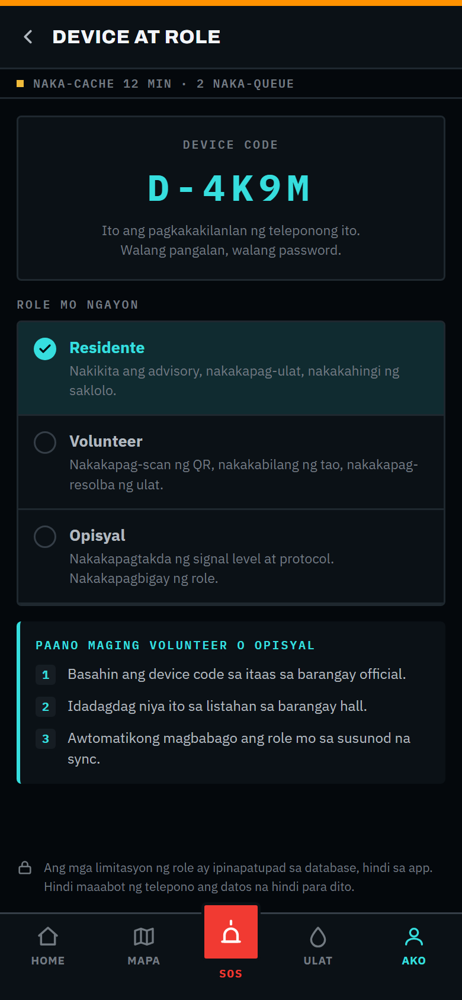

**Profile** — check-in status is the headline rather than a name, because during an evacuation the question this screen answers is "am I counted?". The QR sits at full size without a tap, so a volunteer working a queue of arrivals is not waiting on each person to find a menu.

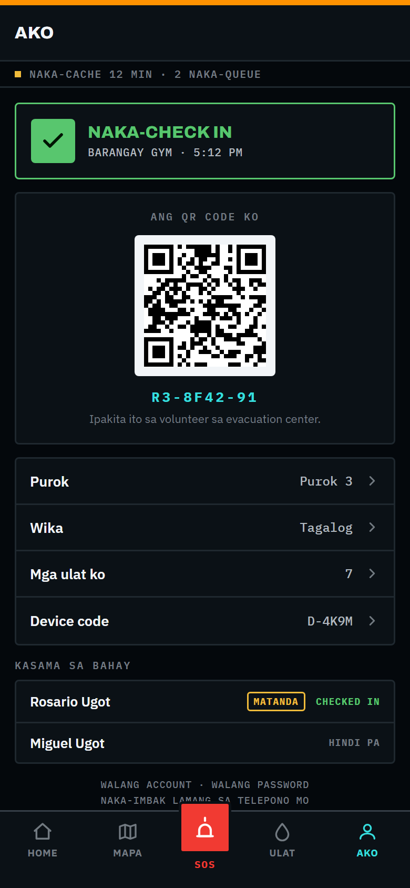

**Reports Feed** — the full list behind the home screen's preview. *Purok ko* is the default filter: the common question is what is happening on this street, not across the barangay. Queued reports appear inside the feed rather than behind a toast, so someone who filed offline can see it sitting there instead of filing again.

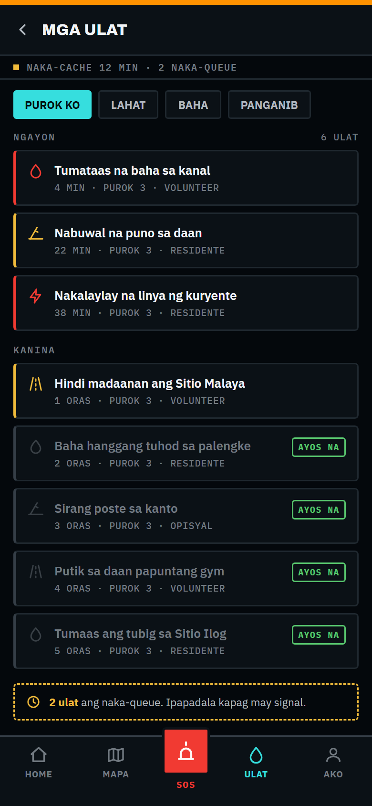

### Reference

**Evacuation Centres** — the resident's own assigned centre is pinned above the list. A closed centre states why it closed, and the list ends with where to go if the assigned one fills; a directory that only reports status has stopped short of the decision.

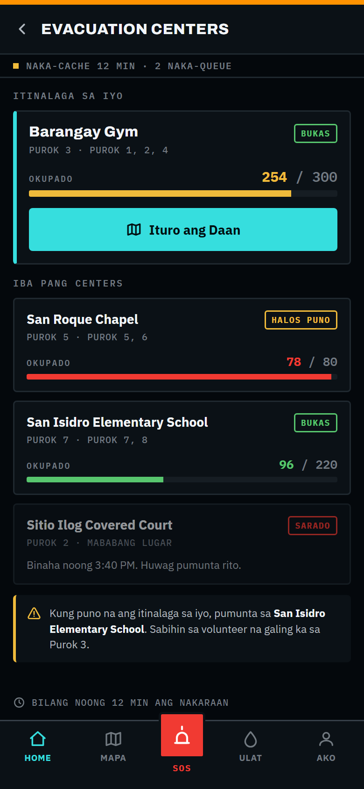

**Readiness Checklist** — progress counts against the leave-by deadline rather than showing a bare percentage. "9 of 14" means little on its own; "9 of 14, and 2h 48m left" is a decision.

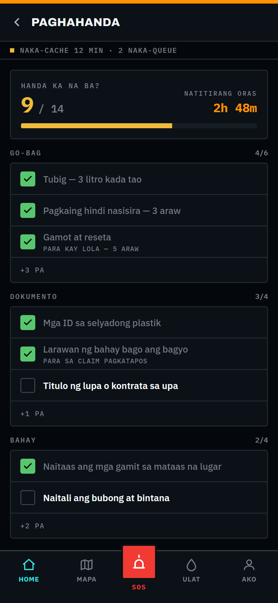

**Guide** — the offline reference. The signal-level table is pinned first because it is the one number a resident will hear on the radio and want translated into an action. Every article is precached: a guide that needs a connection is useless in the situation it describes.

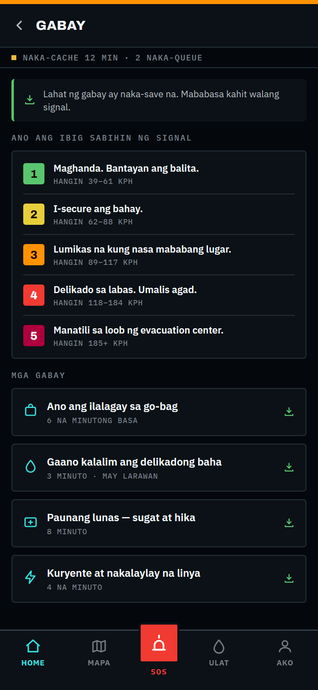

---

## Artboard sources

`artboards/` holds the editable sources as Claude Design Component files (`.dc.html`) plus `canvas.json`, which lays them out on one pan/zoom canvas.

`Main.dc.html` carries two live tweaks: **signal level (1–5)** and **language (Tagalog / Cebuano / English)**. Changing either re-colours and re-words the whole home screen from the same protocol and translation data the real app would use — the clearest demonstration that the localisation layer is data, not hardcoded copy.

The PNGs in `screens/` are a build output, not hand-made exports. Regenerate them with:

```bash
npm run render:design
```

This serves `artboards/` locally and screenshots each one through headless Edge at 2× device scale, sized from `canvas.json`. `support.js` is the small runtime that resolves `{{...}}` placeholders and `<sc-if>`, so the artboards also open and render correctly in a plain browser.

---

## Notes

- Sample data throughout (Barangay San Isidro, "Bagyong Igme", resident names) is placeholder, not real barangay data.
- Screens are static mockups. Only the home artboard has working controls.
- The seven newest screens close the wireframe gaps recorded as Q5 in [`../../docs/TASKS.md`](../../docs/TASKS.md). One of those gaps — a volunteer/official sign-in screen — was resolved by designing something else instead; see **Device & Role** above.
- Full product requirements: [`../PRD.md`](../PRD.md).
